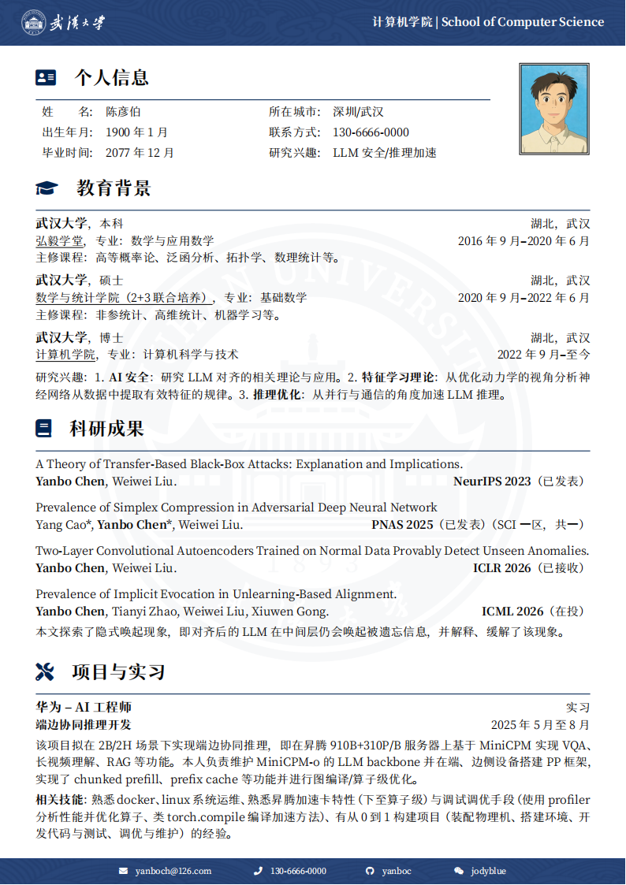
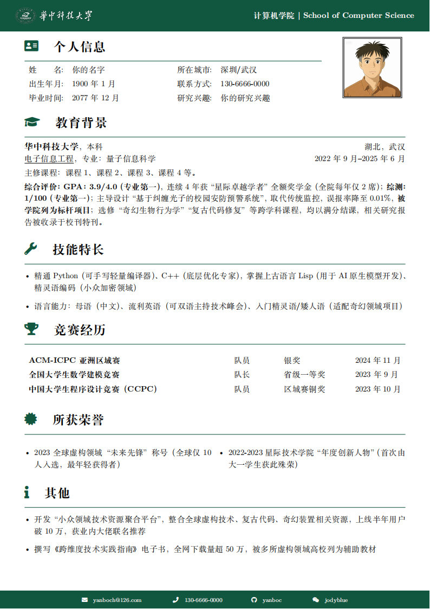
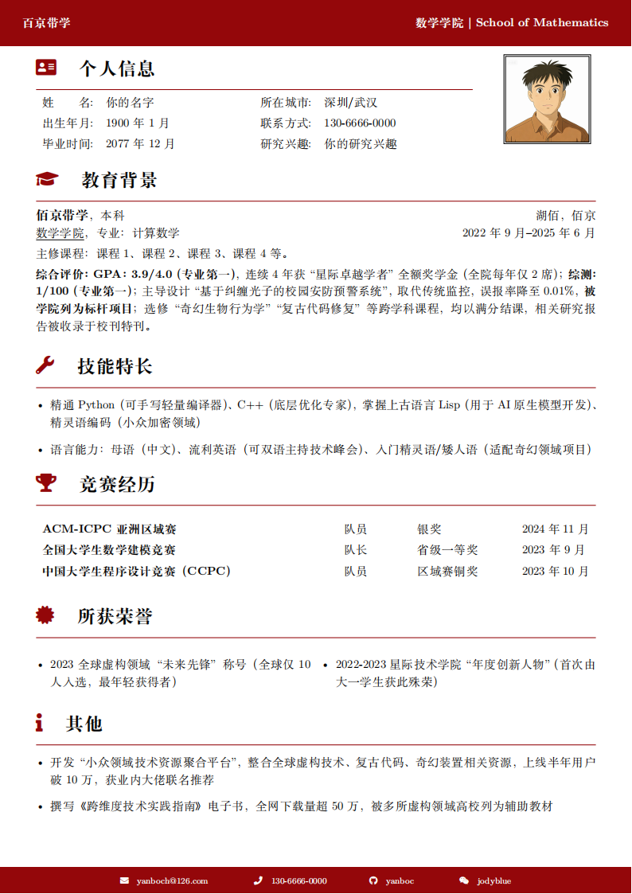
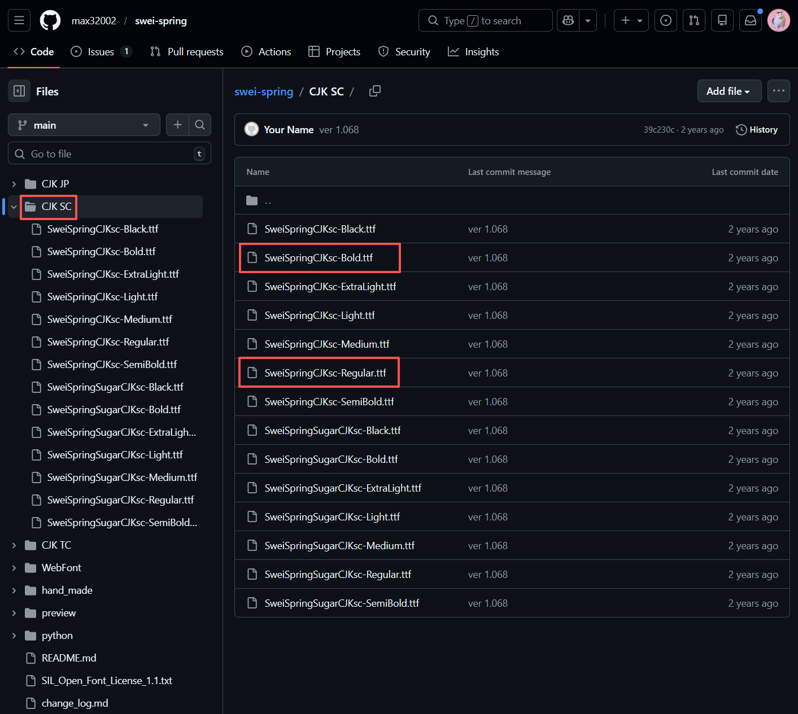

<div align="center">

# LaTeX 中文简历模板

  

</div>

<p align="center">
  
  
  
</p>

<p align="center">
  <em> 不同主题色、字体与模块的示例预览（内容为虚构）</em>
</p>

## 目录

- [使用方法](#使用方法)
  - [编译方式](#编译方式)
  - [填写内容](#填写内容)
  - [自定义学校信息](#自定义学校信息)
  - [自定义主题色](#自定义主题色)
  - [自定义字体](#自定义字体)
  - [注意事项](#注意事项)
- [版权与字体](#版权与字体)
- [参考资料与致谢](#参考资料与致谢)
- [贡献与联系方式](#贡献与联系方式)

---

## 使用方法

### 编译方式

1. **本地编译**：使用 **XeLaTeX** 编译两次。若编译失败，可在 Issues 中反馈（请附上完整错误信息）。
2. **在线编译（推荐）**：将项目打包为 zip 后上传至 [Overleaf](https://www.overleaf.com/)（New Project → Upload Project → 选择 zip 文件）进行编译。

### 填写内容

主文件为 `main.tex`，日常使用**无需修改**该文件（除非要修改排版细节）。  
个人与学校等**全局信息**、**模块开关**及**主题/字体等配置**均在 `config.tex` 中设置；**各模块正文**在 `includefiles` 目录下对应文件中填写。

例如，修改教育背景请编辑 `includefiles/education.tex`，并按以下格式填写：

```tex
% 格式：\addEducation{学校名称}{学位/学历}{学校位置}{学院}{专业}{起止时间}
%       \addCourse{主修课程：...}
%       \addEducationDescription{主修课程/GPA/综测（本科）/研究方向/导师（研究生）}

\addEducation{武汉大学}{本科}{湖北，武汉}{弘毅学堂}{数学与应用数学}{2016年9月--2020年6月}
\addCourse{主修课程：课程1、课程2、课程3、课程4等。}
\addEducationDescription{GAP、排名、综合评价等}
```

按注释中的参数说明填空即可。如需增删模块或调整版式，可自行修改 `main.tex` 或在 Issues 中提出。

**当前支持的模块及对应文件：**

| 模块     | 文件 |
|----------|------|
| 个人信息 | `personal_information.tex` |
| 教育背景 | `education.tex` |
| 科研成果 | `publication.tex` |
| 项目实习 | `projects.tex` |
| 技能特长 | `skills.tex` |
| 竞赛经历 | `competitions.tex` |
| 所获荣誉 | `honor.tex` |
| 其他     | `others.tex` |

**开关模块**：在 `config.tex` 中将对应开关的 `true` / `false` 互换即可。例如不需要「技能特长」时，将 `\def\needSkills{true}` 改为 `\def\needSkills{false}`。  
**模块标题与图标**：同样在 `config.tex` 中配置，例如：

```tex
% 技能特长
\def\needSkills{true}         % 不需要该模块时改为 false
\def\SkillsTitle{技能特长}    % 模块名称，可自定义
\def\SkillsIcon{\faWrench}    % 图标，参见 fontawesome5 文档
```

图标命令以 `\fa` 开头，可选图标见 [Font Awesome 5 文档](https://mirrors.ibiblio.org/CTAN/fonts/fontawesome5/doc/fontawesome5.pdf)。

### 自定义学校信息

学校、院系等文字信息均在 `config.tex` 中修改，例如：

```tex
\newcommand{\schoolNameCH}{武汉大学}
\newcommand{\schoolNameEN}{Wuhan University}
\newcommand{\departmentNameCH}{计算机学院}
\newcommand{\departmentNameEN}{School of Computer Science}
```

**页眉使用校徽**：将校徽图片放入 `images` 目录（如 `school_logo.png`），并在 `config.tex` 中设置：

```tex
\def\useSchoolLogo{true}
\def\schoolLogo{images/school_logo.png}
```

**页眉仅显示校名（无图片）**：可关闭校徽、改用文字：

```tex
\def\useSchoolLogo{false}
\def\useSchoolName{true}
\newcommand{\schoolNameCH}{学校中文名}
\newcommand{\schoolNameEN}{School Name}
```

校徽与配色素材一般可在学校官网下载；若无官方素材，可用上述文字形式替代。

### 自定义主题色

模板默认主题色为深蓝（`#002554`），源自 [西北工业大学中文 CV 模板](https://www.overleaf.com/latex/templates/npu-cv/mncqzxhvfzrx) 的页眉页脚设计，与武汉大学官方配色相近。  
若要更换主题色或使用纯色页眉页脚，请在 `config.tex` 中设置：

```tex
\def\useDefaultTheme{false}   % 关闭默认主题后可使用自定义颜色与纯色页眉页脚
\def\themeColor{WHU_Green}    % 或 WHU_Blue、HUST_Red 等已在 config 中定义的颜色
```

**说明**：默认主题的页眉页脚为**带纹路的图片**，无法通过配置改色。设为 `useDefaultTheme{false}` 后，页眉页脚变为纯色条，比例不变，适合极简风格。

颜色定义示例（在 `config.tex` 中）：

```tex
\definecolor{WHU_Blue}{HTML}{002554}
% \definecolor{WHU_Blue}{RGB}{0, 37, 84}  % 或使用 RGB
```

### 自定义字体

默认使用系统字体。若要使用自定义字体（如狮尾四季春），请在 `config.tex` 中修改：

```tex
\def\useDefaultFont{false}
\def\fontPath{fonts/}
\def\customFontFamilyCH{SweiSpring}
\def\fontFileTypeCH{.ttf}
\def\fontBoldFontCH{* Bold}
\def\customFontFamilyEN{\customFontFamilyCH}
\def\fontFileTypeEN{\fontFileTypeCH}
\def\fontBoldFontEN{\fontBoldFontCH}
```

使用 [狮尾四季春（SweiSpring）](https://github.com/max32002/swei-spring) 时：下载字体后放入 `fonts` 目录，将常规体重命名为 `SweiSpring.ttf`（即 `\customFontFamilyCH` + `\fontFileTypeCH`），粗体重命名为 `SweiSpring Bold.ttf`（即 `\customFontFamilyCH` + `\fontFileTypeCH` + `\fontBoldFontCH`）。也可按自己的命名习惯放置，只要与上述配置一致即可。



### 注意事项

- **分页**：模板分页较为固定。建议优先通过精简内容控制在一页内；若必须分页，可在合适位置使用 `\nextPage`（使用 `\newpage` 可能出现对齐问题）。
- **页眉页脚**：默认款为图片形式，无法在 config 中微调。

---

## 版权与字体

1. 本模板采用 **MIT License**；项目中引用的字体请遵守其各自许可证。
2. 示例中使用的 [狮尾四季春（SweiSpring）](https://github.com/max32002/swei-spring) 为开源字体；字体相关配置见 `config.tex` 中的「字体设置」部分。未启用自定义字体时，将使用系统默认字体。

---

## 参考资料与致谢

本模板的整体结构参考了以下项目：

1. [北师大中文 CV 模板](https://github.com/LeyuDame/BNUCV)
2. [西北工业大学中文 CV 模板](https://www.overleaf.com/latex/templates/npu-cv/mncqzxhvfzrx)

简历内容与版式可参考 [MIT 生涯规划与职业发展 - 简历样例](https://capd.mit.edu/resources/sample-resumes/)：

- [数学系本科生](https://cdn.uconnectlabs.com/wp-content/uploads/sites/123/2025/05/MITCAPD-UndergraduateII.pdf)
- [CS 硕士](https://cdn.uconnectlabs.com/wp-content/uploads/sites/123/2025/05/MITCAPD-MastersIII.pdf)
- [工科博士](https://cdn.uconnectlabs.com/wp-content/uploads/sites/123/2025/05/MITCAPD-PhDII.pdf)

---

## 贡献与联系方式

- 欢迎通过 **Pull Request** 或 **Issues** 提出建议与修改。
- 小红书可搜索 **吃鱼的虎** 联系作者。
